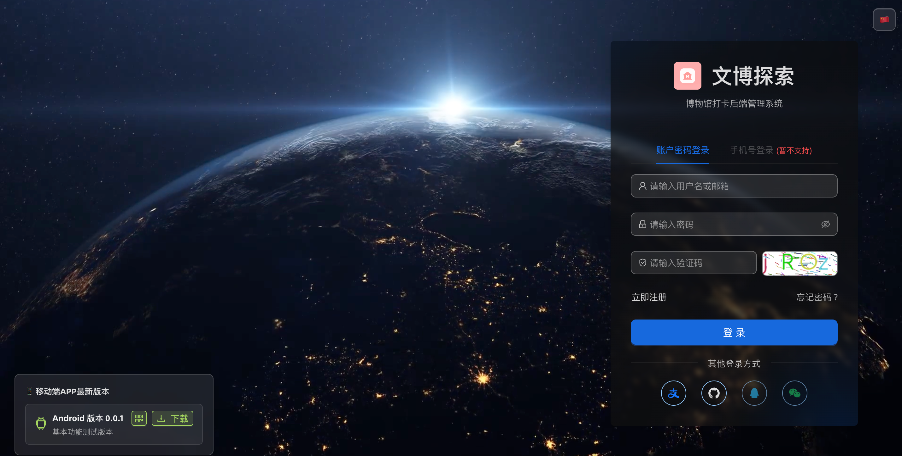
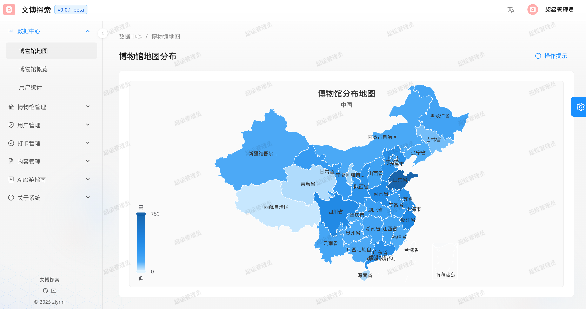
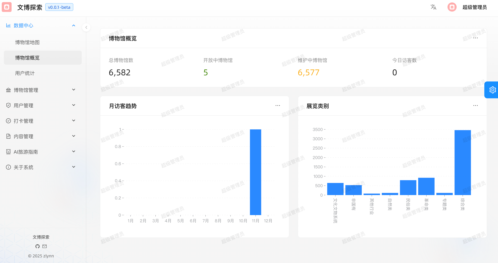
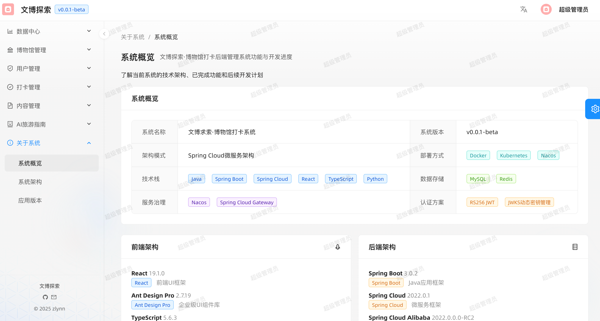

# MSeek-admin-frontend 管理后台前端

<div align="center">

**基于 React 19 + Ant Design Pro 的现代化博物馆管理后台系统**

探索身边的文化宝藏 · 记录每一次博物馆之旅

[](https://react.dev/)
[](https://ant.design/)
[](https://www.typescriptlang.org/)
[](https://umijs.org/)
[](./LICENSE)

</div>

---

## 📱 应用展示

<div align="center">
  
  
  
    
</div>

---

## 📋 项目简介

**MSeek-admin-frontend 管理后台前端** 是一个功能完善的博物馆数字化管理平台，提供博物馆信息管理、用户权限管理、打卡记录审核、内容发布、数据可视化等全方位的管理功能。

### ✨ 核心特色

- 🎯 **现代化技术栈**: React 19 + UmiJS + TypeScript
- 🚀 **高性能**: 基于 Ant Design Pro 的企业级解决方案
- 📊 **数据可视化**: 集成 ECharts、AntV L7 等可视化库
- 🔐 **权限管理**: 细粒度的 RBAC 权限控制体系
- 🌍 **国际化**: 完整的多语言支持
- 📱 **响应式设计**: 完美适配桌面端和移动端

### 🎯 主要功能

#### 📊 仪表盘模块
- **博物馆地图**: 基于 AntV L7 的地理空间数据可视化
- **博物馆概览**: 博物馆数据统计、分类分析、趋势图表
- **用户统计**: 用户增长趋势、活跃度分析、身份分布

#### 🏛️ 博物馆管理模块
- **博物馆列表**: 博物馆信息的增删改查、批量操作、高级筛选
- **博物馆详情**: 完整的博物馆信息展示、Logo、图片、展览等
- **展览管理**: 展览信息维护、时间管理
- **分类管理**: 博物馆分类体系维护
- **标签管理**: 博物馆标签系统
- **区域管理**: 地理区域划分和管理

#### ✅ 打卡管理模块
- **打卡记录**: 用户打卡记录查看、审核、统计分析
- **审核流程**: 打卡照片审核、位置验证
- **数据导出**: 打卡数据导出和报表生成

#### 👥 用户管理模块
- **用户列表**: 用户信息管理、状态控制
- **角色管理**: 角色定义、权限分配
- **权限管理**: 细粒度的权限控制体系

#### 📝 内容管理模块
- **Banner 管理**: 首页轮播图管理、排序、上下架
- **公告管理**: 系统公告发布和管理

#### ℹ️ 关于系统模块
- **系统概览**: 系统介绍、功能说明
- **架构图**: 基于 Mermaid 的系统架构可视化
- **版本管理**: 移动端 App 版本管理和发布

#### 👤 个人中心模块
- **个人信息**: 用户资料编辑
- **密码修改**: 安全密码修改
- **偏好设置**: 个性化配置

## 🚀 快速开始

### 环境要求

- **Node.js**: 20.0.0+ (推荐使用 LTS 版本)
- **包管理器**: Yarn 1.22+ 或 npm 8+ (推荐使用 Yarn)
- **后端服务**: 确保后端 API Gateway 已启动 (默认端口 8000)

### 安装依赖

```bash
# 使用 yarn (推荐)
yarn install

# 或使用 npm
npm install
```

### 开发环境

```bash
# 启动开发服务器 (带代理配置)
yarn start

# 或使用开发环境配置启动
yarn start:dev

# 不使用 Mock 数据启动
yarn start:no-mock

# 访问 http://localhost:8000
```

### 演示环境

- **演示地址**: [https://museum.mseek.online](https://museum.mseek.online)
- **账号密码**: readonly (只读权限，用于演示和测试)

### 构建生产版本

```bash
# 构建生产版本
yarn build

# 预览构建结果
yarn preview

# 分析打包体积
yarn analyze
```

## 📁 项目结构

```
mseek-admin-frontend/
├── config/                        # UmiJS 配置目录
│   ├── config.ts                 # 主配置文件 (Webpack、插件等)
│   ├── routes.ts                 # 路由配置 (菜单、权限)
│   ├── proxy.ts                  # 开发代理配置
│   └── defaultSettings.ts        # 默认设置
│
├── public/                        # 静态资源目录
│   ├── favicon.ico
│   └── icons/
│
├── docs/                          # 项目文档
│   └── images/                   # 文档图片资源
│
├── src/                           # 源代码目录
│   ├── components/               # 公共组件
│   │   ├── RightContent/        # 顶部右侧内容
│   │   ├── Footer/              # 页脚组件
│   │   ├── MermaidDiagram/      # Mermaid 图表渲染
│   │   ├── PermissionControl/   # 权限控制组件
│   │   └── ErrorBoundary/       # 错误边界
│   │
│   ├── pages/                    # 页面组件
│   │   ├── dashboard/           # 仪表盘
│   │   │   ├── museum-map/     # 博物馆地图
│   │   │   ├── museum-overview/ # 博物馆概览
│   │   │   └── identity-overview/ # 用户统计
│   │   ├── museums/             # 博物馆管理
│   │   │   ├── list/           # 博物馆列表
│   │   │   ├── detail/         # 博物馆详情
│   │   │   ├── form/           # 博物馆表单
│   │   │   ├── exhibitions/    # 展览管理
│   │   │   ├── categories/     # 分类管理
│   │   │   ├── tags/           # 标签管理
│   │   │   ├── areas/          # 区域管理
│   │   │   └── checkin-records/ # 打卡记录
│   │   ├── users/               # 用户管理
│   │   │   ├── user/           # 用户列表
│   │   │   ├── role/           # 角色管理
│   │   │   └── permission/     # 权限管理
│   │   ├── content/             # 内容管理
│   │   │   ├── banner/         # Banner 管理
│   │   │   ├── recommendation/ # 推荐管理
│   │   │   └── announcement/   # 公告管理
│   │   ├── checkins/            # 打卡管理
│   │   ├── ai-guide/            # AI 导览
│   │   ├── about/               # 关于系统
│   │   ├── profile/             # 个人中心
│   │   ├── login/               # 登录页
│   │   └── oauth2/              # OAuth2 回调
│   │
│   ├── services/                 # API 服务层
│   │   ├── museum-service-api/  # 博物馆服务 API
│   │   ├── user-service-api/    # 用户服务 API
│   │   ├── auth-service-api/    # 认证服务 API
│   │   ├── file-service-api/    # 文件服务 API
│   │   ├── ai-recommend/        # AI 推荐 API
│   │   └── app-version/         # 版本管理 API
│   │
│   ├── utils/                    # 工具函数
│   │   ├── request.ts           # HTTP 请求封装
│   │   ├── auth.ts              # 认证工具
│   │   └── format.ts            # 格式化工具
│   │
│   ├── models/                   # 数据模型 (UmiJS Model)
│   ├── hooks/                    # 自定义 Hooks
│   ├── constants/                # 常量定义
│   ├── types/                    # TypeScript 类型定义
│   ├── locales/                  # 国际化文件
│   ├── access.ts                 # 权限定义 - 基于角色的访问控制
│   ├── app.tsx                   # 运行时配置
│   ├── global.tsx                # 全局配置
│   └── requestErrorConfig.ts     # 请求错误配置
│
├── tests/                         # 测试文件
├── .husky/                        # Git Hooks
├── Dockerfile                     # Docker 构建文件
├── package.json                   # 项目依赖
├── tsconfig.json                  # TypeScript 配置
├── biome.json                     # Biome 配置
└── jest.config.ts                 # Jest 测试配置
```

## 🔧 配置说明

### API 网关配置

在 `config/config.ts` 和 `config/proxy.ts` 中配置后端服务地址：

```typescript
// config/config.ts
const API_GATEWAY_URL = 'http://localhost:8000';
// 生产环境
// const API_GATEWAY_URL = 'https://museum.mseek.online';
```

### 代理配置

开发环境代理配置在 `config/proxy.ts`，支持以下路径：

```typescript
export default {
  dev: {
    // API 请求代理
    '/api/v1/**': {
      target: 'http://localhost:8000',
      changeOrigin: true,
    },
    // API 文档代理
    '/doc.html': {
      target: 'http://localhost:8000',
      changeOrigin: true,
    },
    // 文件上传代理
    '/upload/**': {
      target: 'http://localhost:9000',
      changeOrigin: true,
    },
  },
};
```

### 路由和权限配置

路由配置在 `config/routes.ts`，每个路由可配置：

```typescript
{
  path: '/museums/list',
  name: 'museum-list',
  locale: 'menu.museum-list',  // 国际化 key
  icon: 'HomeOutlined',         // 菜单图标
  component: './museums/list',  // 组件路径
  access: 'canViewMuseums',     // 权限控制
}
```

权限定义在 `src/access.ts`，基于用户角色和权限动态控制。

## 📝 开发规范

### 命名规范

| 类型 | 规范 | 示例 |
|-----|------|------|
| 页面目录 | 小写短横线分隔 | `museum-list/` |
| 组件文件 | PascalCase | `MuseumCard.tsx` |
| 工具函数 | camelCase | `formatDate.ts` |
| 常量 | 大写下划线分隔 | `API_BASE_URL` |
| 样式文件 | 与组件同名 | `MuseumCard.less` |

### 代码规范

- ✅ 使用 **Biome** 进行代码检查和格式化
- ✅ 遵循 TypeScript 严格模式
- ✅ 统一使用 2 空格缩进
- ✅ 使用函数组件 + Hooks
- ✅ 添加必要的类型定义和注释
- ✅ 优先使用 antd-style 或 CSS Modules

### 提交规范

```bash
# 功能开发
git commit -m "feat: 添加博物馆 Logo 上传功能"

# Bug 修复
git commit -m "fix: 修复用户编辑表单验证问题"

# 文档更新
git commit -m "docs: 更新项目文档"

# 样式调整
git commit -m "style: 优化博物馆列表布局"

# 代码重构
git commit -m "refactor: 重构 API 请求层"
```

## 🧪 测试

项目使用 **Jest** 和 **React Testing Library** 进行测试：

```bash
# 运行所有测试
yarn test

# 运行测试并生成覆盖率报告
yarn test:coverage

# 更新测试快照
yarn test:update
```

### 测试文件结构

```
tests/
├── components/        # 组件测试
├── services/         # API 测试
└── utils/            # 工具函数测试
```

## 🔧 技术栈

### 前端技术

| 技术 | 说明 | 版本 |
|-----|------|------|
| React | 最新的 React 版本，支持并发特性 | 19.1.0 |
| UmiJS | 企业级前端应用框架 | 4.3.24 |
| TypeScript | 类型安全的 JavaScript 超集 | 5.6.3 |

### 核心能力

- **UI 组件库**: Ant Design 5.25.4 + Pro Components 2.7.19
- **数据可视化**: ECharts 6.0.0 + AntV L7 2.22.7 + Ant Design Plots 2.6.0
- **权限管理**: 基于 RBAC 的细粒度权限控制
- **国际化**: 完整的多语言支持
- **样式方案**: antd-style 3.7.0 + CSS Modules
- **开发工具**: Biome 2.0.6 + Husky 9.1.7 + Jest 30.0.4

## 🎨 特色功能

### 1. 地理空间可视化
基于 **AntV L7** 实现的博物馆地图，支持：
- 全国博物馆分布热力图
- 聚合点展示和交互
- 地图缩放和平移
- 博物馆详情弹窗

### 2. 数据可视化
使用 **ECharts** 和 **Ant Design Plots** 实现：
- 博物馆统计图表
- 用户增长趋势
- 打卡数据分析
- 实时数据更新

### 3. 架构图渲染
集成 **Mermaid** 实现：
- 系统架构图动态渲染
- 流程图可视化
- 支持多种图表类型

### 4. 权限控制
细粒度的权限管理：
- 基于角色的访问控制 (RBAC)
- 菜单级权限控制
- 按钮级权限控制
- 数据级权限控制

### 5. 响应式设计
- 支持桌面端和移动端
- 自适应布局
- 优雅的交互体验

## 🐛 常见问题

### 1. 启动失败

**问题**: 启动时报错或白屏

**解决方案**:
```bash
# 清除缓存和依赖
rm -rf node_modules .umi .umi-production
yarn install

# 或使用 npm
rm -rf node_modules .umi .umi-production
npm install
```

### 2. 接口请求失败

**问题**: API 请求返回 404 或连接失败

**解决方案**:
1. 检查后端服务是否启动 (默认端口 8000)
2. 检查 `config/proxy.ts` 中的代理配置
3. 检查浏览器控制台的网络请求
4. 确认 API 路径是否正确 (应为 `/api/v1/...`)

```bash
# 测试后端服务
curl http://localhost:8000/actuator/health
```

### 3. 构建失败

**问题**: 执行 `yarn build` 时失败

**解决方案**:
```bash
# 检查 Node.js 版本
node -v  # 应该 >= 20.0.0

# 清除构建缓存
rm -rf dist .umi .umi-production
yarn build
```

### 4. 地图不显示

**问题**: 博物馆地图页面空白

**解决方案**:
1. 检查是否有博物馆数据
2. 检查浏览器控制台是否有 WebGL 错误
3. 确认浏览器支持 WebGL

### 5. 权限问题

**问题**: 某些菜单或功能无法访问

**解决方案**:
1. 检查用户角色和权限配置
2. 查看 `src/access.ts` 中的权限定义
3. 确认后端返回的用户权限数据

## 📚 相关文档

### 📖 项目文档

- 📗 **API 文档**: http://localhost:8000/doc.html
- 📘 **后端文档**: [mseek-admin-backend/README.md](../mseek-admin-backend/README.md)

### 🔗 外部资源

| 资源 | 链接 | 说明 |
|-----|------|------|
| React 官方文档 | [查看](https://react.dev/) | React 开发指南 |
| UmiJS 文档 | [查看](https://umijs.org/) | UmiJS 框架文档 |
| Ant Design | [查看](https://ant.design/) | UI 设计系统 |
| TypeScript | [查看](https://www.typescriptlang.org/) | TypeScript 语言参考 |

---

## 🤝 贡献指南

欢迎贡献代码、提出问题和建议！

### 贡献流程

1. Fork 本仓库
2. 创建特性分支 (`git checkout -b feature/AmazingFeature`)
3. 提交更改 (`git commit -m 'feat: 添加某个功能'`)
4. 推送到分支 (`git push origin feature/AmazingFeature`)
5. 提交 Pull Request

### 问题反馈

- 🐛 **Bug 反馈**: [提交 Issue](https://github.com/zketer/mseek-admin-frontend/issues)
- 💡 **功能建议**: [提交 Issue](https://github.com/zketer/mseek-admin-frontend/issues)
- 💬 **技术讨论**: [GitHub Discussions](https://github.com/zketer/mseek-admin-frontend/discussions)

---

## 👥 开发团队

- **项目维护**: zlynn
- **联系邮箱**: museumseek@163.com
- **GitHub**: [@zketer](https://github.com/zketer)

---

## 📄 开源协议

本项目采用 MIT 许可证 - 详见 [LICENSE](./LICENSE) 文件

---

<div align="center">

**MSeek 博物馆管理后台**

探索文化 · 记录足迹 · 分享美好

Made with ❤️ by zlynn

---

**最后更新**: 2025-12-03  
**当前版本**: v0.0.1-beta

</div>
